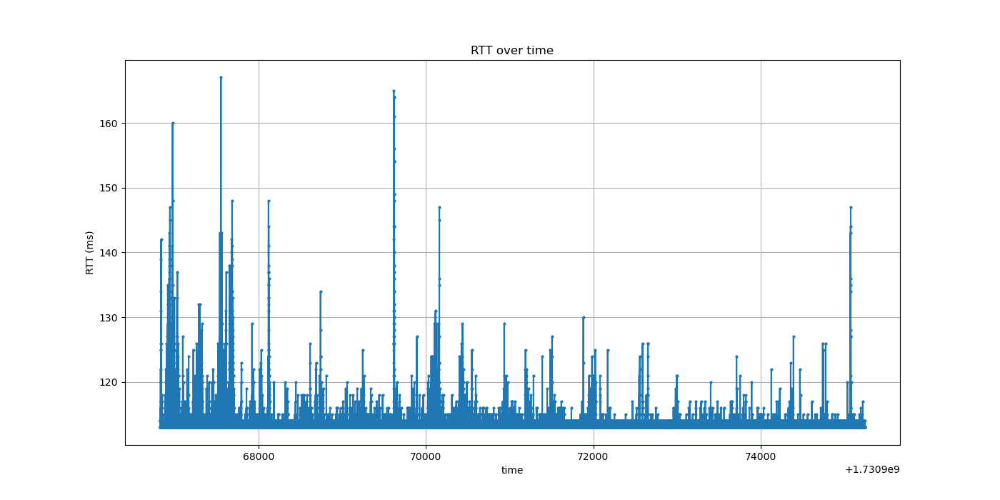
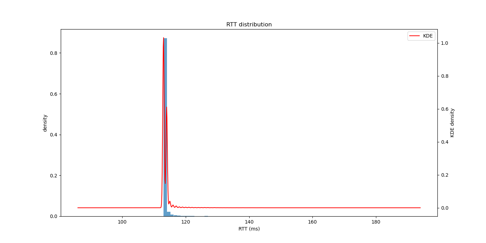
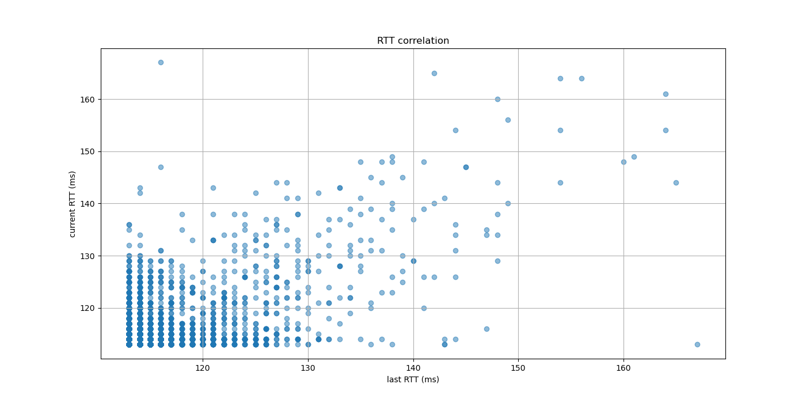

## 数据分析
### 代码结果
根据题目要求编写代码于附件`ping_analysis.py`中。代码运行所得结果为  
总ping次数: 41983  
成功ping次数: 41850  
网络路径的整体交付率为 99.68%。  
最长连续成功ping为 16047 次。  
最长连续失败ping为 117 次。  
给定成功后下一次成功的概率为 99.99%。  
给定失败后下一次成功的概率为 0.00%。  
平均延迟: 113.66 ms  
最小延迟为 113.00 毫秒。  
最大延迟为 167.00 毫秒。
### 题解
1. 整体交付率为99.68%。
2. 最长连续成功ping为16047。
3. 最长连续失败ping为117。
4. 
    - 给定成功后下一次成功的概率为 99.99%。 
    - 给定失败后下一次成功的概率为 0.00%。
    - 分析数据可知，损失具有一定的突发性，成功请求之后的成功率更高，失败请求之后的成功率更低。
5. 最小RTT为113ms。
6. 最大RTT为167ms。
7. 如图
8. 如图
9. 如图
10. 通过分析，令我惊讶的点是ping失败的时间段非常连续，在网络不好的时候会大量出现ping失败，这与我一开始设想的ping失败分布均匀不同。