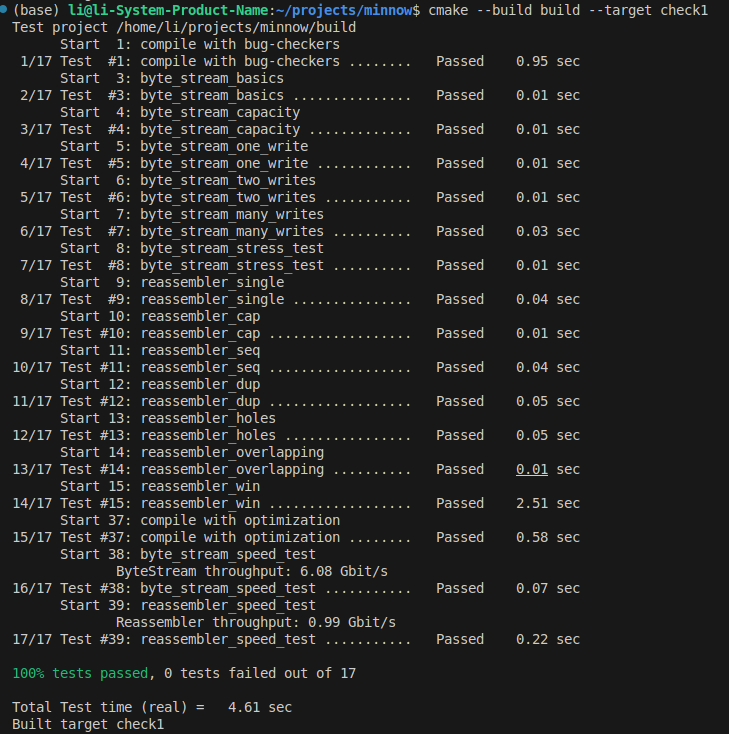

My name: 李明扬

My Student number : 502024330026

This lab took me about 3 hours to do. I did attend the lab session.

#### 1. Program Structure and Design:

- 本次实验主要要求实现`Reassembler`类，将收集到的字符串拼接在一起。需要考虑到ByteStream的容量，将超出容量部分的字符串舍弃。还需要注意是否输入了eof，在合适的时候调用`close()`。
- 我采用了STL中的`deque`类来作为本次实验的主要数据结构。我定义了两个`deque`类，分别用来存储正在重组的字符以及用`bool`来表示某个位置是否存在字符。每一个`deque`预留足够的空间来避免从中间插入字符从而提升效率。在插入字符时，将特定位置的值改为`true`，再将字符写入。在写入字节流时，只需要把`deque`中前面的字符输出即可。
- 为了使字符串按照顺序排列，我维护了一个索引变量，用以表示队列中第一个字符在整个字节流中的位置。在每次写入字节流时，对这个值进行更新。
- 为了实现`eof`的写入，我维护了另一个索引变量，用于表示`eof`在队列中的位置。当收到`eof`并将其加入缓存中时，就开始维护这个变量，每次写入字节流就更新这个变量。直到这个变量变为0，则调用`close()`表示结束。

#### 2. Implementation Challenges:

- 本次实验最大的挑战在于如何维护许多可能会重叠的子字符串。如果将子字符串全部保存下来，会存在大量重叠，不方便写入，也不利于计算索引。于是我在插入字符串时，将字符串分解为字符来一个一个写入，从而降低了维护难度。

- 另一个挑战是对于索引的计算。每个字符在整个字节流中有一个索引，在队列中也有一个索引，需要通过计算将其一一对应。这一过程比较繁琐，需要仔细分析才能写对代码。

- 如何确定什么时候调用`close()`也是一个问题，需要确定`eof`是否被加入到了队列中，以及其在队列中的哪个位置，这个位置需要随着队列的流动而更新。

#### 3. Remaining Bugs:

- 暂时尚未找到bug。

测试结果如下图

