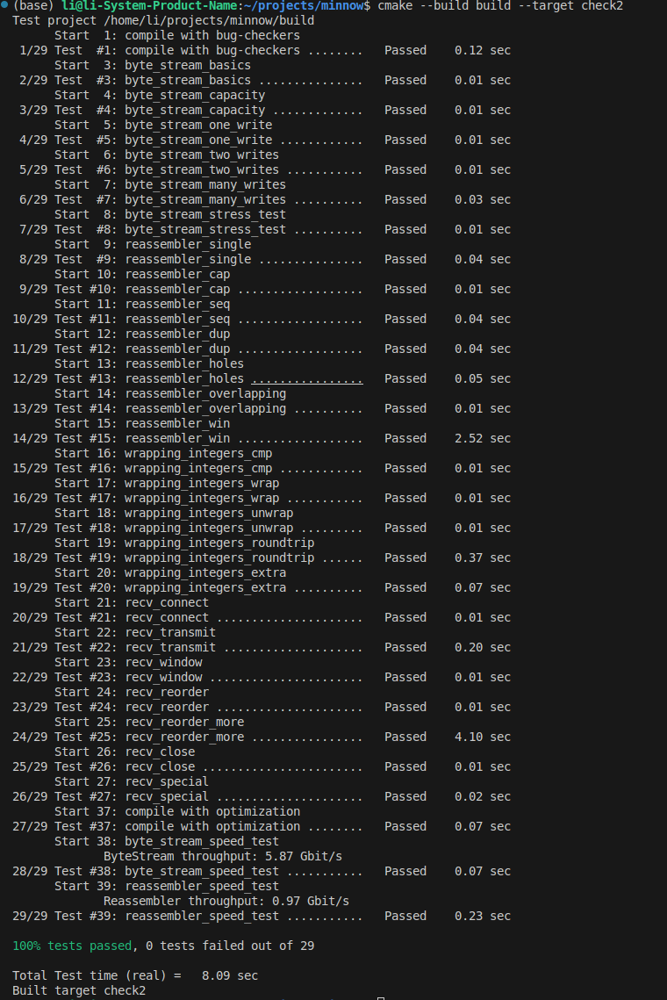

My name: 李明扬

My Student number : 502024330026

This lab took me about 3 hours to do. I did attend the lab session.

#### 1. Program Structure and Design:

- 第一部分内容要求在64位的absolute seqno和32位的seqno之间进行相互转换
   - wrap的实现
      将64位的absolute seqno转换为32位的seqno比较简单，因为其高的32位并不会影响结果，所以只需将给出的absolute seqno加上isn值，再将其强制转换为32位即可。
   - unwrap的实现
      要实现seqno到absolute seqno的转换，首先需要求出目标索引到isn之间的偏移量offset。仔细阅读实验手册，可以注意到，absolute seqno的取值是k*2^{32}+offset,k=0,1,2...中最接近checkpoint的值。实验手册提到，checkpoint的值为the index of the last reassembled byte，因此，若offset<=checkpoint，则可以判定k的值为0，直接返回offset即可。反之，若offset的值比较大，这时就需要计算k的值。此时可以考虑offset与checkpoint的差值与2^{32}之间的关系：只需分别对其进行求商x和求余y，此时就可以判定k的值为x*2^{32}或(x+1)*2^{32}。若其余数的大小超过了2^{31}，也就是2^{32}的一半，则说明k更接近较大的一个，则最终的取值为(x+1)*2^{32},反之则k的取值为x*2^{32}。确定了k之后则可得到最终答案。
- 第二部分内容要求实现一个TCP接收器，总体上较为简单。
  - receive的实现
    - 当收到RST时，调用set_error。
    - 设置Initial Sequence Number(ISN)
      维护一个ISN的变量，再维护一个布尔值判定有没有收到ISN。若收到的Segment Header中syn值为true，则说明该Segment的首字节序列号即为ISN的值，将其写入即可，并将判定有没有收到ISN的布尔值设置为true。
    - 将数据发送到Reassembler中
      该功能的实现要分为两方面来考虑。第一，如果收到的Segment本身并没有设置isn值，且此时ISN尚未被其他Segment设置，则直接将该Segment舍弃，不将其推入StreamReassembler中。第二，如果ISN已经被设置，则通过之前实现的unwrap来获得absolute seqno，并将其转换为stream index，将checkpoint的值设置为StreamReassembler的bytes_written，也就是the index of the last reassembled byte。数据的推入只需调用StreamReassembler的push_string即可，其eof参数即为Segment Header中的fin值。需要注意的是，如果是首段，则需要将其seqno加1，因为SYN本身占据了一个字节的位置。
  - send的实现  
    - 要实现这个方法，我们首先需要弄清楚什么是the first byte that the receiver doesn't already know。因为StreamReassembler维护了一个bytes_written方法，且其会尽可能多的往字节流里写数据，故而显然，需要返回的索引是已经写入字节流的数据的后一个。有了上面的分析，接下来的实现就比较简单：若ISN尚未设置，则该函数直接返回empty。若ISN已经被设置，则返回bytes_pushed()+1。需要注意的是，若fin已经被写入，则返回的值应该还要加1。
    - window_size定义为16位无符号数，故其最大值为65535，在空闲容量和65535之间取最小值。

#### 2. Implementation Challenges:

- unwrap的实现  
  本次实验的第一大挑战就是关于unwrap。
  - 首先是偏移量offset的计算，框架代码中给出的WrappingInt32的减法返回值是一个有符号32位整数，而我们需要的其实是一个无符号32位整数。因此在偏移量的计算上需要我们对其做进一步的分类讨论。
  - 其次是对checkpoint的认识。一开始我对其理解不足，在看了讲义举的例子后认为所求值的格式应该为$2^{32+x}+offset,x=0,1,2...$，因此所求结果在一开始就相去甚远。在反复对该概念进行思考之后，我才明白所求的值应该为$k*2^{32}+offset,k=0,1,2...$。接下来的步骤就基本上是运用数学知识进行推理计算了。
- receive的实现  
  这个方法的总体思路比较简单，但仍然具有难点。我在一开始实现该方法时，并未将首段与其他段区分开，而是统一调用insert，因此一直实现错误。后来我才发现，SYN符号只是占用了序列号中的一个位置，其并未在发送的数据中占据位置，因此在发送首段时需要将序列号加1以进行匹配。在将这点进行区分后，这个方法的实现就没什么问题了。
- send的实现  
  这个方法与上一个方法类似，也是具有一些隐含的坑点。一开始我一直不能通过测试，后来我在认真研读测试用例后才发现，当fin已被推入Reassembler后，ackno的期待返回值是最后一位的序列号的后一位，也就是说需要对其加1。意识到这一点后，该方法的实现也就很容易了。

#### 3. Remaining Bugs:

- 暂时尚未找到bug。

测试结果如下图