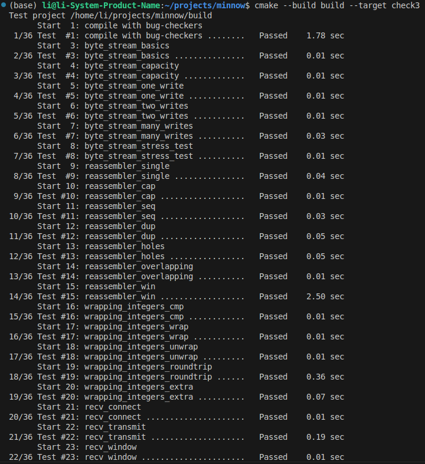
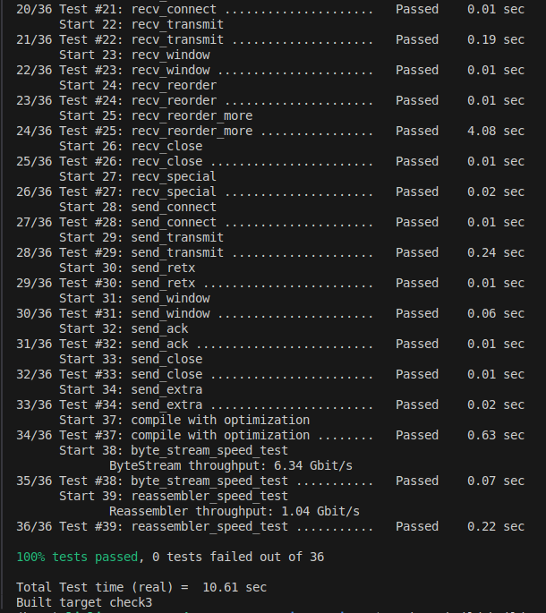

My name: 李明扬

My Student number : 502024330026

This lab took me about 8 hours to do. I did attend the lab session.

#### 1. Program Structure and Design of the TCPSender:
本实验主要要求我们实现一个TCPSender类。
- 需求分析
  本实验的关键点在于向接收方发送TCPSegment，并将未收到ACK的Segment储存下来，以便之后进行重发。此外，由于报文在传输过程中可能会丢失，我们还需要实现一个TCPTimer类，用其来进行时间管理，并在超时后完成重发TCP、更新RTO的值等事务。
- 类中所维护的变量
  类中所维护的变量主要有isn值、接收方窗口大小、下一个即将发送的序列号、初始的RTO、收到过的最大ACK值以及用以储存未收到ACK的segment的队列等等。
- 存储未收到ACK的Segments的数据结构的选择
  我选择了C++的STL标准库中的**queue**来作为存储outstanding segments的数据结构，原因有下：
  - 于outstanding segments总是按照序号的先后来进行重发，序号大的segment不可能在序号小的segment之前被重发，并且在第一次发送的时候也是严格按照序号的顺序，所以这是一个“先进先出”的数据结构，应该使用队列来对其进行维护。
  - 正如上分析，该过程会涉及到大量的元素删除与添加的操作，而queue是经过特别优化后的专用于队列操作的的数据结构，其性能会很好。
  - queue的实现和接口均十分完善，可以节省很多的数据结构实现步骤，并提高代码的复用性。
- TCPTimer类的实现
  由于我们需要对TCPSender进行时间管理，如果将时间管理的相关代码直接实现在TCPSender类之中，会使其非常冗杂，无法专注于TCPSender功能的实现，同时也会大大提升维护难度。因此，我将时间管理的相关代码单独提取出来，并用其实现一个新的TCPTimer类，将其作为TCPSender类的私有成员，从而提高代码的复用性，降低维护难度。
  - TCPTimer类中的主要变量有RTO值，时钟开启后的时间time_passed以及标志TCPTimer是否正在运行的bool值is_running。
  - TCPTimer类中的主要方法
    - start_timer：开启时钟，并将is_running设置为true，time_passed设置为0。
    - stop_timer：关闭时钟，将is_running设置为false。
    - is_running：判定时钟当前是否开启。
    - double_rto：将RTO的值设置为当前的2倍。
    - set_rto：设置RTO值。
    - tick：更新time_passed，若time_passed超过RTO，则将time_passed设为0，并返回true，意味需要进行重发等操作。其他情况则返回false。
- 主要方法的实现
  - push
    该方法的主要功能是填充window。对于该功能，需要分两种情况进行讨论：如果当前尚未发送SYN，则发送一个只包含SYN的Segment，并将_syn_sent设置为true；如果已经发送了SYN，则反复读取stream中的数据，向接受方发送Segment，直到window已经被填充满，或者stream中数据已经被读取完毕。
  - receive
    该方法的主要功能是接收ACK，并进行一些相关的设置。当收到ACK后，先将outstanding segments中可以被确定收到的segments删去，并更新相应的bytes_in_flight值。若ACK的值比之前的所有ACK都要大，则将RTO设为初始值，并将连续的重发次数置为0。若所有报文都被确认，则关闭时钟。在更新window_size之后调用fill_window，以填充窗口。
  - tick
    先调用TCPTimer的tick方法，若返回true，则说明RTO的时间已到，需要进行重发，即调用resend_segment（将在后文介绍）。
  - resend_segment
    该方法是我自己定义的一个私有方法，主要进行segment的重发，目的是使tick操作与重发操作分离，方便管理维护。该方法先重发outstanding segments的最早的segment。之后，若当前窗口大小大于0，则将RTO值加倍，并将连续的重发次数加1。若当前时钟关闭，则将其开启。
- 其他方法的实现都比较简单。
#### 2. Implementation Challenges:
- 对于**push**的实现：
  在实现push，循环调用send_segment的时候，我在一开始一直没有弄清楚边界条件，要么就一直陷入循环调用的死循环，要么就在应当发送segment的时候而没有发送。在重新理解了window_size与发送segment的时机之后，我对该方法进行了重写。循环条件仍然是**while (_receiver_free_space > 0)**，在stream不为空的时候，则正常调用send_segment。若stream为空，若当前stream已到达eof，且fin并没有并发送过，则调用send_segment，主要目的是为了发送fin，并在之后直接跳出循环。若stream为空但是其他条件不满足，则直接跳出循环即可。
- 对于**window_size**与**receiver_free_space**的理解：
  一开始我对这两者的区分仅仅是receiver_free_space只是window_size的一个copy，并在调用fill_window的时候不断减小。然而这样并不能通过测试。后面我发现，当传回的window_size的值为0时，仍然需要发送数据。于是我就在传回的window_size为0是将这两者都设置为1。然而这样仍然有问题，因为在window_size为0时，我们不应当将RTO的值翻倍。因此，最后我的解决方案是，在传回的window_size为0时，将receiver_free_space设置为1，而window_size仍然置为0，这样便可以正确地实现功能。

#### 3. Remaining Bugs:
暂时尚未找到bug。

测试结果截图如下：

