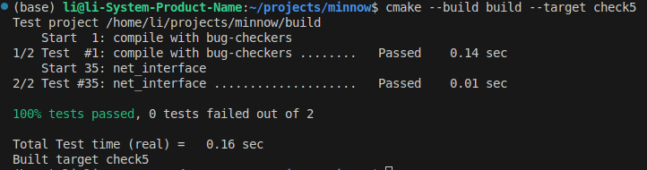

My name: 李明扬

My Student number : 502024330026

This lab took me about 3 hours to do. I did attend the lab session.

#### 1. Program Structure and Design:

本实验主要要求将链路层和网络层结合起来，实现一些接口。
- 需求分析  
    为了将数据包发送到ip地址指定的Mac地址，需要保存ip地址和Mac地址之间的映射。这样的映射只能保持30s，因此还需要保存每个映射的开始存储的时间。此外，需要将未发送的数据包缓存起来，在取得相应的Mac地址后再进行发送。需要对发送的ARP和ipv4进行区别，记录ARP的发送时间，避免不必要的发送。在发送ARP时还需处理其内容，填写ARPMessage。
- 数据结构的选择  
    - 存储ip地址到Mac地址之间的映射的数据结构：由于需要多次提取ip地址所对应的Mac地址，且提取的先后顺序并没有联系，为了保证性能，我选择了C++的标准STL库中的unordered_map来作为存储的数据结构。它类似于哈希表，可以在O(1)的时间获取Mac地址，并且并不会按照键的大小来排序，能够提升性能，从而达到快速获取存储的Mac地址的目的。此外，我在存储的值中还加入了存储的时间，方便判断其超出30s与否。
    - 存储未发送的数据包的数据结构：由于在获取了Mac地址后，需要马上发送相应的缓存的数据包，并不能发送其他地址的数据包，所以在此处用队列显然不合适，它不能快速地获取特定地址的未发送的数据包。同样的，这里也不能使用map，因为一个地址可能有多个数据包需要发送，map中的键值对是唯一的。因此，我最后选取了C++的标准库中的multimap来作为存储的数据结构。它能够快速获取目标地址相应的数据包，同时一个键可以对应多个值。
    - 存储ARP的发送时间的数据结构：我选用的unordered_map，理由与第一条相同。
- 类中所维护的变量  
    除了以上三个用以存储的数据结构以外，类中还维护了已经过去的时间，本接口的ip地址和Mac地址等变量。
- 主要方法的实现  
    - send_datagram:检查目标ip所对应的Mac地址是否存储或者过期，如果过期了就删除。如果找到了Mac地址，则将数据打包发送即可。如果未找到，则需要广播ARP，并将数据进行缓存，以便在之后进行发送。
    - recv_frame:对frame的种类进行分类讨论。如果收到的是ipv4，则将ipv4数据报提取出来，再检查其目标Mac地址是否相符，如果符合则将其上传到网络层。如果收到的是ARP，则需要将其ip到Mac地址的映射保存下来，如果其恰好在请求本接口的Mac地址，则需要向其发送一个回复的ARP报文。最后，需要检查是否可以发送之前缓存过的数据包。
    - tick:只需要更新_time_passed即可。

#### 2. Implementation Challenges:

- 数据结构的选用。因为本实验需要管理许多地址、时间等数据之间的映射，所以简单高效地进行数据存储就显得十分关键。在对实验需求和不同的数据结构进行研究后，才最终决定选择哈希表来作为主要数据结构，并为每个映射添加了时间。
- 不同协议数据的转换和填写。本实验涉及到很多不同层次的协议，需要对它们进行装载和转换等操作。此外，ARP协议的具体字段在书上并未提及，需要自行了解。有一些细节值得注意，例如：在广播ARP时，以太网帧
的目标Mac地址为0xFFFFFF，但ARP报文的目标Mac地址为0x000000。再比如，收到包时，只需要匹配mac地址，不需要匹配ip地址。

#### 3. Remaining Bugs:

暂时尚未发现bug。

*More details and requirements of sections above can be found in `lab6_tutorials.pdf/6.submit`*

测试结果截图如下：  
