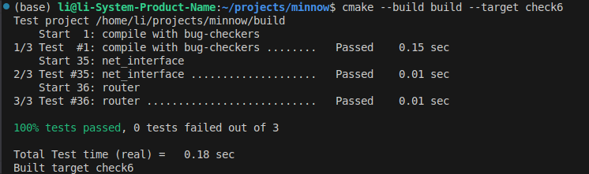

My name: 李明扬

My Student number : 502024330026

This lab took me about 5 hours to do. I did attend the lab session.

#### 1. Program Structure and Design:

本次实验要求实现一个Router类，总体较为简单。
- 需求分析  
    Router类的主要功能是路由，需要维护一个routing table。因此我们需要一个数据结构来储存routing table的信息。此外，该类还需要对收到的数据报的目标地址进行匹配，如果匹配到了route，则在相应的route上发送数据报。
- 数据结构的选择  
    考虑到routing table的表项比较复杂，每一个表项需要存储四个信息，因此用复杂的数据结构会比较麻烦。此外，本次实验并没有对性能做太高的要求，只需要做到O(N)的时间复杂度即可。因此，权衡以上后，我将每个表项的信息整合为一个struct，并用C++的STL标准库的vector来作为routing table进行存储。vector设计精巧，便于增加数据，非常适合用来进行表的存储。
- 主要方法的实现  
    - add_route  
        在确定了数据结构后，该方法只需生成一个新的表项结构体，再调用`vertor.push_back()`将表项加入到表中即可。
    - route_one_datagram  
        该方法是本类的核心方法，主要功能是进行数据的路由。先将其与routing table中的表项进行匹配。进行匹配时，如果相应的prefix_length值为0，则直接匹配成功；如果是其他值，则将route_prefix和目标地址都右移(32-prefix_length)位之后再进行比较。最后选取prefix_length最大的结果，如果没有匹配到任何表项，则舍弃。之后再检查数据头的ttl字段，如果不符合要求，则将其舍弃，如果符合要求则将其值减1。上述步骤做完后，再调用匹配到的网络接口的`send_datagram`来进行数据发送即可。需要注意的是，在改变了ipv4表头之后，需要重新计算其校验码。

#### 2. Implementation Challenges:

- 在route的匹配上面有一定的挑战。本次实验要求匹配两个地址的前n个比特，因此需要将地址右移(32-n)位后再进行比较。如果n为0，则直接匹配成功，不需要进行额外的移位处理。
- 在ipv4表头改变后，需要重新计算其校验码。这个细节虽然微小，但对结果影响很大，一旦发生错误并不容易发现。
- 在这个实验中，我找出了上个实验中的潜在的bug，这花费了我相当多的时间。
- 这个lab是系列实验的最后一个lab，总体而言，这一系列的实验对我的帮助非常大，让我深入理解了许多仅凭看书无法透彻的知识。希望未来能接触到更多类似的优秀的实验。

#### 3. Remaining Bugs:

暂时尚未发现bug。

实验测试结果截图如下：  
